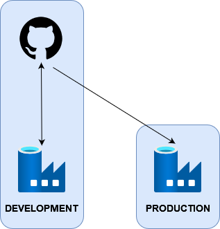

# Continuous Integration and Deployment with Azure Data Factory

[](https://github.com/PeerChristensen/AzureDataFactory-CICD-Template/actions/workflows/workflow.yml)

## Description

This repo functions as a template and contains code for deploying a Data Factory along with pipelines, triggers etc. to a different environment, e.g. a production environment. Commits to the main branch trigger a deployment to the production environment, but only if the ARM-template for the Data Factory contains changes. The workflow may also be triggered manually.

## CI/CD Pipeline Overview

This repo may be cloned and then connected to an existing Data Factory via the Azure Portal. When configuring the GIT integration, you have to set 'main' as the working and release branch. This way, the main branch is always up to date with respect to the current release. 

It is strongly recommended that users use feature branches for development, which can later be merged into the main branch following pull requests and a resonable review process.

Importantly, only the Data Factory used for development should be connected to a GIT repo. The production Data Factory is 'read-only' and managed exclusively by means of templates generated by changes to the development Data Factory.



## Prerequisites

- Access to the Azure Portal with permission to create resources
- A GitHub account
- A Self-Hosted Integration Runtime installed to copy local data (if needed)
- Azure CLI and Git Bash installed (optional, if using a local command prompt to interact with Azure)

## Instructions

1. Modify workflow.yml

Set the below environment variables to match your Azure resources. Note that `ARMTEMPLATEFOLDER_NAME` is the same as the name of your development Data Factory.

```
env:
    RESOURCEGROUP_NAME: your-production-resourcegroup-name
    DATAFACTORY_NAME: your-production-datafactory-name
    ARMTEMPLATEFOLDER_NAME: your-folder-with-arm-templates
```

2. Allow GitHub to access and change your production environment

- using the Azure Azure CLI, open a Git Bash prompt.
- login to Azure:

```
az login
```
- create a Service Principal and copy the JSON-formatted output string. Make sure to substitute {subscription-id} and {resource-group} with your own values.
```
az ad sp create-for-rbac --name "myApp" --role contributor \
                                --scopes /subscriptions/{subscription-id}/resourceGroups/{resource-group} \
                                --sdk-auth
```
- In your clone of this repo, go to Settings > Secrets > Actions and click 'New repository secret'
- In the Name field, type the following: `AZURE_CREDENTIALS`
- In the Secret field, paste the JSON string copied previously and save.

## Troubleshhoting
**If deployments fail due to Authorization errors**

In this case, you may need to create a custom role (note the lacking permissions in the error message). In the Azure portal you can create a custom role within your resource group by adding the relevant data factory permissions to the contributor role and supply a meaningful name for the new role definition. After doing so, you will need to update the service principal with the new role assignment and copy-paste the JSON output to update the GitHub secret (`AZURE_CREDENTIALS`)

## Useful Links
- [Installing Azure CLI](https://learn.microsoft.com/en-us/cli/azure/install-azure-cli)
- [Create and configure a self-hosted integration runtime](https://learn.microsoft.com/en-us/azure/data-factory/create-self-hosted-integration-runtime?tabs=data-factory)
- [Create a shared self-hosted integration runtime in Azure Data Factory](https://learn.microsoft.com/en-us/azure/data-factory/create-shared-self-hosted-integration-runtime-powershell?source=recommendations#create-a-shared-self-hosted-integration-runtime-in-azure-data-factory-1)
